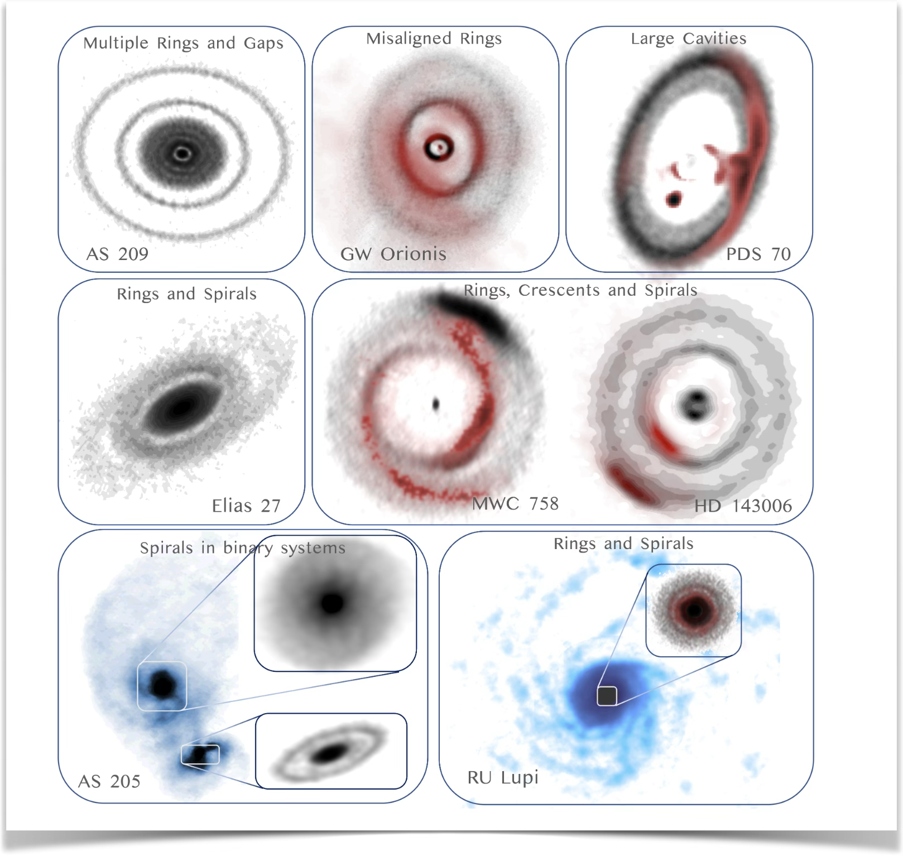
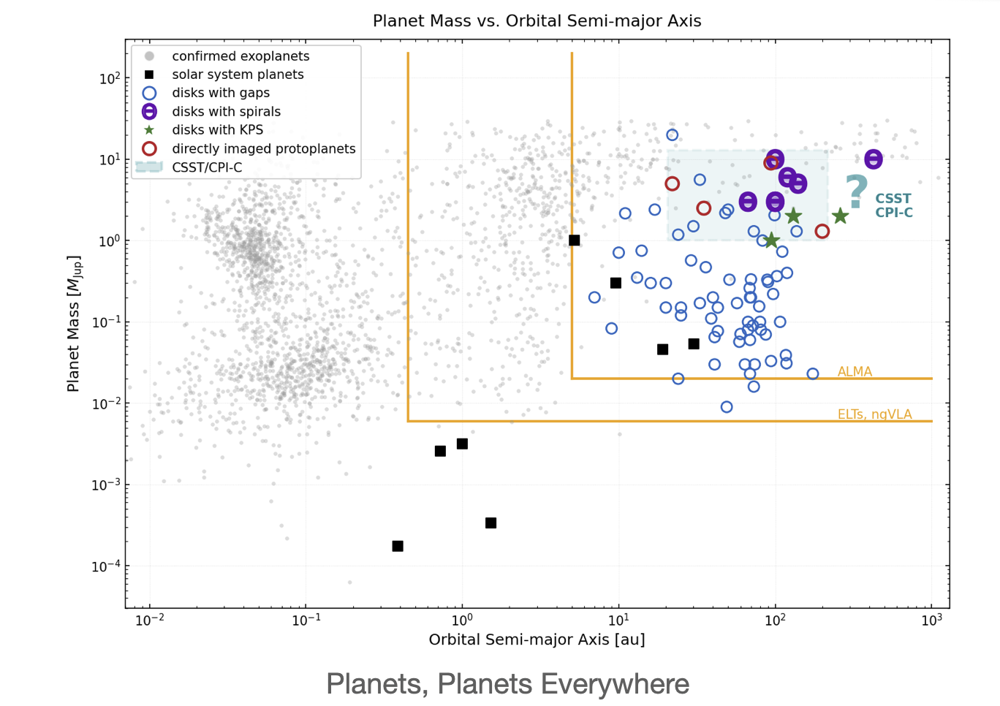
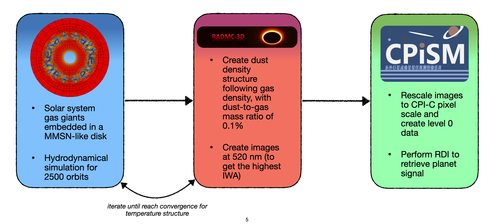
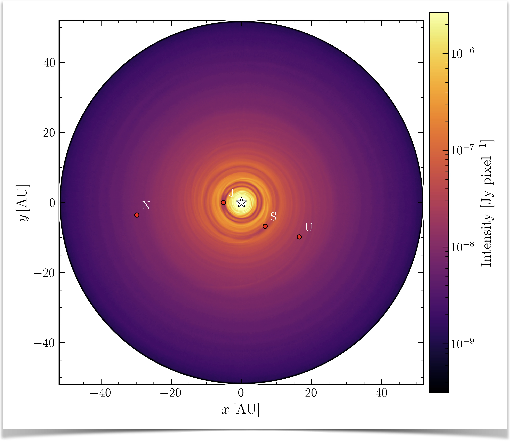

+++
date = '2026-07-15T06:37:14+05:30'
draft = false
title = 'Towards observables for the Chinese Space Station Telescope'
summary = 'This work investigates the detectability of embedded giant planets and disk substructures with the proposed Cool Planet Imaging Coronagraph (CPI-C).'
+++

This work investigates the detectability of embedded giant planets and disk substructures with the proposed **Cool Planet Imaging Coronagraph (CPI-C)**.

Current observations of protoplanetary disks with ALMA and high-contrast near-IR instruments routinely reveal rings, gaps, spirals, and cavities that are likely signatures of planet-disk interactions. However, directly imaging the planets responsible for these structures remains challenging due to contrast and inner working angle limitations. CPI-C aims to improve upon existing facilities by providing visible/NIR coronagraphic imaging with higher contrast and smaller inner working angles.

To evaluate CPI-C performance, I developed an end-to-end synthetic observation pipeline:

- Gas-only hydrodynamical simulations of Solar System giant planets embedded in an MMSN-like disk (~2500 planetary orbits).
- Dust density reconstruction assuming a dust-to-gas mass ratio of 0.1%.
- Monte Carlo radiative transfer to generate scattered-light images at 520 nm.
- Instrument simulation using CPISM to produce Level-0 CPI-C observations.
- Reference Differential Imaging (RDI) using VIP to recover planetary signals.



The simulations quantify the impact of coronagraphic suppression and instrument systematics on disk morphology and planet detectability. While nearby (10 pc) systems remain well resolved, typical star-forming regions (~140 pc) present significant challenges because much of the disk lies within the coronagraph's inner working angle.

Current work focuses on improving the realism of the instrument noise model, extending the pipeline to better handle extended scattered-light sources, and investigating debris disks as alternative targets. Future simulations will couple **REBOUND** N-body integrations with scattered-light ray tracing to generate synthetic observations of debris disk systems.
